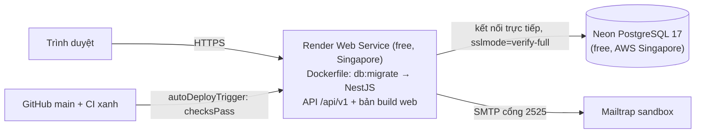

# Dựng môi trường DEMO (Render + Neon + Mailtrap)

Quyết định: [`docs/04-decisions/2026-09-15-018-demo-deploy.md`](04-decisions/2026-09-15-018-demo-deploy.md) · issue #18.
**Chỉ để demo** — không nhập dữ liệu thật, không cam kết sao lưu. Gói free: server ngủ sau 15 phút không truy cập
(mở lại mất ~1 phút), đăng nhập ~4–5 giây vì 0.1 CPU.

## Kiến trúc



## 1. Neon — database

1. Tạo project mới: **PostgreSQL 17**, region **AWS Asia Pacific (Singapore)** (không đổi được sau khi tạo).
2. Lấy connection string của role owner mặc định ở chế độ **Direct** (host **không** có `-pooler`), thêm
   `?sslmode=verify-full`. Đây là `DATABASE_URL_OWNER`.
3. Chọn mật khẩu cho 2 role ứng dụng — Neon yêu cầu ≥ 60 bit entropy; tạo ngẫu nhiên, ví dụ:
   ```bash
   openssl rand -base64 24
   ```
   Không cần tạo role tay: lần khởi động đầu, `db:migrate` tạo `planix_app`, `planix_platform` và đặt mật khẩu lấy
   từ connection string.
4. `DATABASE_URL_APP` / `DATABASE_URL_PLATFORM` = cùng host Direct, cùng database, user `planix_app` /
   `planix_platform`, mật khẩu vừa tạo, `?sslmode=verify-full`. Mã hoá URL (`encodeURIComponent`) nếu mật khẩu có
   ký tự đặc biệt.

## 2. Mailtrap — hộp thư bắt email

1. Tạo inbox **Email Sandbox** (không phải Email Sending).
2. Lấy thông tin SMTP; dùng cổng **2525** (Render free chặn 25/465/587).
   `SMTP_URL=smtp://<username>:<password>@<host>:2525`
3. Mọi email lời mời / đặt lại mật khẩu của demo nằm trong inbox này, không tới người thật.

## 3. Render — web service

1. Dashboard → **New → Blueprint** → chọn repo này; Render đọc `render.yaml` (service `planix-demo`, free,
   Singapore, Docker, health check `/api/v1/health`, deploy khi CI của commit trên `main` xanh).
2. Nhập các biến `sync: false`: `DATABASE_URL_OWNER`, `DATABASE_URL_APP`, `DATABASE_URL_PLATFORM`, `SMTP_URL`,
   và `APP_BASE_URL`.
3. `APP_BASE_URL` phải **đúng** origin trình duyệt dùng: `https://<tên-service>.onrender.com` (không có `/` cuối).
   Nếu chưa biết URL khi tạo: tạo xong → sửa biến → **Manual Deploy**.
4. Deploy đầu tiên: log phải có `Applied: 0001_…, …` rồi `Nest application successfully started`; mở
   `https://<service>.onrender.com/api/v1/health` → `{"status":"ok"}`.

## 4. Tạo Platform Operator đầu tiên

Chạy **từ máy người vận hành** (repo đã `npm install`), kết nối thẳng tới Neon; link đặt mật khẩu dẫn về demo.
Không gõ mật khẩu/connection string thẳng trên dòng lệnh (sẽ nằm lại trong shell history): ghi vào file tạm chỉ
mình đọc được, dùng xong xoá ngay.

1. Tạo file `.env.operator` ở thư mục gốc repo (đã bị `.gitignore` bỏ qua qua mẫu `.env*`), chỉnh quyền:
   ```bash
   touch .env.operator && chmod 600 .env.operator
   ```
2. Mở bằng trình soạn thảo và điền (không dán vào terminal):
   ```text
   TZ=UTC
   APP_BASE_URL=https://<service>.onrender.com
   DATABASE_URL_OWNER=<owner direct url>?sslmode=verify-full
   DATABASE_URL_APP=<app url>?sslmode=verify-full
   DATABASE_URL_PLATFORM=<platform url>?sslmode=verify-full
   SMTP_URL=<mailtrap smtp url>
   ```
3. Chạy lệnh với các biến đó:
   ```bash
   set -a && . ./.env.operator && set +a && npm run ops:grant-operator -- --email <email-operator> --create --locale vi
   ```
4. Xoá file ngay sau khi xong:
   ```bash
   rm -P .env.operator 2>/dev/null || rm -f .env.operator
   ```

Nếu nghi file hoặc lịch sử terminal bị lộ: đổi mật khẩu owner trên Neon, đổi mật khẩu `planix_app`/`planix_platform`
(sửa URL trên Render rồi deploy lại — `db:migrate` đặt lại mật khẩu), và đổi mật khẩu Mailtrap.

Mở email trong Mailtrap → link `…/password-reset/<token>` (hạn 1 giờ) → đặt mật khẩu → đăng nhập → `/platform/organizations`
tạo tổ chức demo. Tài khoản đã tồn tại thì dùng `--confirm` thay cho `--create`.

## 5. Kiểm sau deploy đầu tiên

- **`trust proxy` (#14):** `render.yaml` đặt `TRUST_PROXY_HOPS=1` — **chưa đúng hoàn toàn** (kiểm 2026-09-16: khoá
  bucket là IP proxy nội bộ xoay vòng; `2` còn tệ hơn), đang chờ đọc chuỗi header thật. Mỗi response đăng nhập
  có header `ratelimit-policy: … pk=<mã khoá bucket>` và `ratelimit: … r=<lượt còn lại>`. Gửi vài request **không**
  kèm `X-Forwarded-For`, rồi vài request kèm IP giả khác nhau, và so `pk`:
  ```bash
  for h in "" "" "" "X-Forwarded-For: 192.0.2.1" "X-Forwarded-For: 192.0.2.2" "X-Forwarded-For: 192.0.2.3"; do curl -s -D - -o /dev/null -X POST "https://<service>.onrender.com/api/v1/auth/login" -H "Origin: https://<service>.onrender.com" -H "Content-Type: application/json" ${h:+-H "$h"} -d '{}' | grep -ioE 'pk=:[^:]+:|r=[0-9]+' | tr '\n' ' '; echo; done
  ```
  - **Đúng:** cả 6 dòng cùng **một** `pk`, `r` giảm dần.
  - **Hop quá ít** (`pk` xoay giữa vài giá trị dù không gửi header): đang lấy IP proxy nội bộ → mọi người dùng chung
    bucket. Tăng `TRUST_PROXY_HOPS`.
  - **Hop quá nhiều** (`pk` đổi theo IP giả): client tự chọn được IP, né được rate limit. Giảm ngay.
  Mỗi request bị tính vào giới hạn 30 lần / 15 phút của IP người kiểm.
- **HSTS:** header có `Strict-Transport-Security` — chấp nhận cho `*.onrender.com`; xem lại khi dùng domain riêng (#14).

## Vận hành

- **Phát hành:** merge vào `main` → CI (`quality-gate`, `docker-image`) xanh → Render tự build và deploy. Container
  mới chạy `db:migrate` (có advisory lock) rồi mới nhận traffic; migration lỗi → bản cũ tiếp tục chạy.
- **Chạy thử image ở máy:** `docker build -t planix-demo:local .` rồi chạy với `--memory=512m --cpus=0.1` và các biến
  môi trường như trên (xem decision).
- **Nâng lên staging thật:** không sửa demo — ra quyết định mới (đổi `plan`, `preDeployCommand`, SMTP gửi thật, sao
  lưu, xử lý hết #14).
