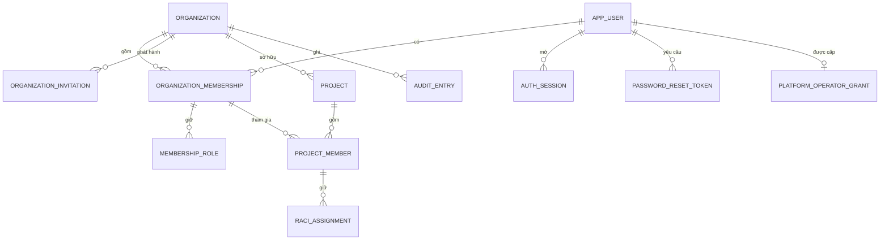
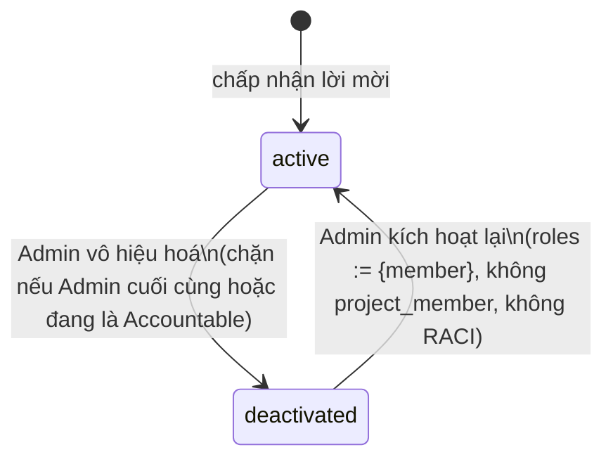
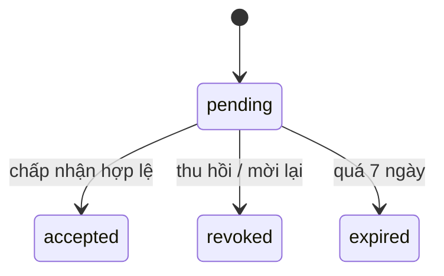

# Data Model — organization-access

**Spec**: [spec.md](spec.md) · **Research**: [research.md](research.md) · **Date**: 2026-09-14

Tên theo `docs/00-glossary.md` (định danh code `camelCase` trong TypeScript, `snake_case` cho bảng/cột
PostgreSQL). Mọi id là UUID v7. Mọi thời điểm là `timestamptz` (UTC). **(T)** = bảng có `organization_id`
và bật Row-Level Security (research R3).

## Sơ đồ quan hệ

## Thực thể

### `app_user` — User (Người dùng)

| Cột | Kiểu | Ràng buộc |
|---|---|---|
| `id` | uuid | PK |
| `email` | citext | NOT NULL, **UNIQUE toàn hệ thống** (không phân biệt hoa thường — FR-005) |
| `password_hash` | text | NOT NULL, argon2id |
| `locale` | text | NOT NULL, `vi` \| `en`, mặc định `vi` |
| `time_zone` | text | NOT NULL, IANA tz, mặc định `Asia/Ho_Chi_Minh` |
| `failed_login_count` | int | NOT NULL, mặc định 0 |
| `locked_until` | timestamptz | NULL |
| `last_active_organization_id` | uuid | NULL — tổ chức dùng gần nhất, để tự chọn khi đăng nhập |
| `created_at`, `updated_at` | timestamptz | NOT NULL |

- Không có trạng thái vô hiệu hoá ở cấp user: vô hiệu hoá là theo **membership** (decision đa tổ chức).
- Chỉ tạo khi chấp nhận lời mời (FR-005).
- Khoá đăng nhập: sai lần thứ 5 liên tiếp → `locked_until = now + 15 phút`, đếm về 0; đăng nhập đúng → đếm về 0.

### `platform_operator_grant` — Platform Operator

| Cột | Kiểu | Ràng buộc |
|---|---|---|
| `user_id` | uuid | PK, FK → `app_user` |
| `granted_at` | timestamptz | NOT NULL |
| `granted_by` | text | NOT NULL (người vận hành chạy CLI) |

Không có `organization_id`; không bật RLS; chỉ đọc bởi guard `/platform/*` (research R11).

### `organization` — Organization (Tổ chức)

| Cột | Kiểu | Ràng buộc |
|---|---|---|
| `id` | uuid | PK |
| `name` | text | NOT NULL, 1–200 ký tự |
| `status` | text | `active` \| `suspended`, mặc định `active` |
| `created_by_operator_id` | uuid | FK → `app_user`, NOT NULL |
| `created_at`, `updated_at` | timestamptz | NOT NULL |

RLS: policy đặc biệt `id = current_setting('app.organization_id')` cho role ứng dụng; route `/platform/*` dùng
role/đường truy vấn riêng không đọc bảng nghiệp vụ khác.

### `organization_membership` — Organization Membership (Thành viên tổ chức) **(T)**

| Cột | Kiểu | Ràng buộc |
|---|---|---|
| `id` | uuid | PK |
| `organization_id` | uuid | FK, NOT NULL |
| `user_id` | uuid | FK → `app_user`, NOT NULL |
| `status` | text | `active` \| `deactivated` |
| `deactivated_at` | timestamptz | NULL |
| `created_at`, `updated_at` | timestamptz | NOT NULL |

- UNIQUE `(organization_id, user_id)` — một user nhiều membership ở **các tổ chức khác nhau** (FR-017).
- **Chuyển trạng thái**:

- Vô hiệu hoá (FR-015): trong 1 transaction → `status=deactivated`, xoá mọi `membership_role` trừ lưu audit,
  đặt mọi `project_member` của membership sang `removed`, gỡ mọi `raci_assignment`. Chặn nếu vi phạm FR-014
  hoặc FR-020 → `409`.
- Kích hoạt lại (decision reactivation): `status=active`, thêm `membership_role(member)`.

### `membership_role` — gán vai trò hệ thống **(T)**

| Cột | Kiểu | Ràng buộc |
|---|---|---|
| `organization_id` | uuid | NOT NULL |
| `membership_id` | uuid | FK → `organization_membership` |
| `role` | text | `admin` \| `portfolioLead` \| `projectManager` \| `functionalManager` \| `member` \| `finance` |
| `granted_at` | timestamptz | NOT NULL |

- PK `(membership_id, role)` — nhiều vai trò, quyền là hợp (decision đa vai trò).
- **Bất biến FR-014**: mỗi tổ chức ≥ 1 membership `active` có role `admin` — kiểm trong transaction gỡ vai trò /
  vô hiệu hoá (khoá hàng các admin của tổ chức `FOR UPDATE` để tránh 2 Admin gỡ nhau đồng thời).
- Membership `active` luôn có ít nhất 1 role (mặc định `member`).

### `organization_invitation` — Organization Invitation (Lời mời) **(T)**

| Cột | Kiểu | Ràng buộc |
|---|---|---|
| `id` | uuid | PK |
| `organization_id` | uuid | NOT NULL |
| `email` | citext | NOT NULL |
| `roles` | text[] | NOT NULL, ⊆ tập vai trò; mặc định `{member}`; lời mời Admin đầu tiên `{admin}` |
| `token_hash` | bytea | NOT NULL, UNIQUE (SHA-256) |
| `status` | text | `pending` \| `accepted` \| `revoked` \| `expired` |
| `expires_at` | timestamptz | `created_at + 7 ngày` |
| `invited_by_user_id` | uuid | NOT NULL (Admin hoặc Operator) |
| `invited_by_kind` | text | `organizationAdmin` \| `platformOperator` |
| `created_at`, `accepted_at` | timestamptz | |

- Partial UNIQUE `(organization_id, email) WHERE status = 'pending'` — tối đa 1 lời mời hiệu lực/email/tổ chức;
  mời lại → lời mời cũ `revoked` trong cùng transaction (edge case).
- Mời email đã là membership `active` → `409 ALREADY_MEMBER`; email có membership `deactivated` → hướng Admin
  dùng kích hoạt lại.
- Chấp nhận: token hợp lệ + `pending` + chưa hết hạn; user chưa có → tạo `app_user` với mật khẩu hợp lệ; user có
  sẵn → phải đăng nhập đúng email được mời.

### `project` — Project (Dự án) **(T)**

| Cột | Kiểu | Ràng buộc |
|---|---|---|
| `id` | uuid | PK |
| `organization_id` | uuid | NOT NULL |
| `name` | text | NOT NULL, 1–200 ký tự |
| `description` | text | NULL, ≤ 5.000 ký tự |
| `status` | text | `active` \| `archived` (v1 chỉ tạo `active`) |
| `created_by_membership_id` | uuid | NOT NULL |
| `created_at`, `updated_at` | timestamptz | NOT NULL |

Tạo dự án (FR-018, decision single Accountable): 1 transaction tạo `project` + `project_member(người tạo)` +
`raci_assignment(người tạo, accountable)`.

### `project_member` — Project Member (Thành viên dự án) **(T)**

| Cột | Kiểu | Ràng buộc |
|---|---|---|
| `id` | uuid | PK |
| `organization_id` | uuid | NOT NULL |
| `project_id` | uuid | FK → `project` |
| `membership_id` | uuid | FK → `organization_membership` (phải `active`, cùng tổ chức) |
| `status` | text | `active` \| `removed` |
| `added_at`, `removed_at` | timestamptz | |

- Partial UNIQUE `(project_id, membership_id) WHERE status = 'active'`.
- FK tổ hợp `(organization_id, project_id)` và `(organization_id, membership_id)` → DB từ chối ghép chéo tổ chức.
- Xoá khỏi dự án → `status=removed` (giữ lịch sử), gỡ RACI; chặn nếu đang là Accountable → `409`.

### `raci_assignment` — RACI Assignment (Gán RACI) **(T)**

| Cột | Kiểu | Ràng buộc |
|---|---|---|
| `organization_id` | uuid | NOT NULL |
| `project_id` | uuid | NOT NULL |
| `project_member_id` | uuid | FK → `project_member` (`active`) |
| `raci_role` | text | `responsible` \| `accountable` \| `consulted` \| `informed` |
| `assigned_at` | timestamptz | NOT NULL |

- PK `(project_member_id, raci_role)` — một thành viên nhiều vai trò RACI.
- Partial UNIQUE `(project_id) WHERE raci_role = 'accountable'` + domain invariant "đúng 1" (research R7).
- **Thay Accountable**: 1 transaction xoá A cũ + thêm A mới; gỡ A không kèm người thay → `409 ACCOUNTABLE_REQUIRED`.

### `auth_session` — Session (Phiên đăng nhập)

| Cột | Kiểu | Ràng buộc |
|---|---|---|
| `id_hash` | bytea | PK (SHA-256 của session id trong cookie) |
| `user_id` | uuid | FK → `app_user` |
| `active_organization_id` | uuid | NULL (chưa chọn); phải là membership `active` của user |
| `csrf_token_hash` | bytea | NOT NULL |
| `created_at`, `last_seen_at` | timestamptz | NOT NULL |

- Hết hiệu lực khi `now - last_seen_at > 8 giờ` (FR-007). Không có "ghi nhớ đăng nhập".
- Mỗi request kiểm lại membership của `active_organization_id` → membership bị vô hiệu hoá thì request bị từ chối
  và `active_organization_id` bị xoá (SC-004).
- Đặt lại mật khẩu thành công → xoá mọi phiên của user (FR-031).

### `password_reset_token` **(không có tổ chức)**

| Cột | Kiểu | Ràng buộc |
|---|---|---|
| `id` | uuid | PK |
| `user_id` | uuid | FK → `app_user` |
| `token_hash` | bytea | UNIQUE |
| `expires_at` | timestamptz | `created_at + 1 giờ` |
| `used_at`, `superseded_at` | timestamptz | NULL |

Yêu cầu mới → mọi token chưa dùng của user được đặt `superseded_at` (chỉ bản mới nhất hiệu lực).

### `audit_entry` — Audit Entry (Bản ghi kiểm toán) **(T, nullable)**

| Cột | Kiểu | Ràng buộc |
|---|---|---|
| `id` | uuid | PK |
| `organization_id` | uuid | NULL cho sự kiện nền tảng/tài khoản (đăng nhập, đặt lại mật khẩu) |
| `actor_user_id` | uuid | NULL (hệ thống) |
| `actor_kind` | text | `user` \| `platformOperator` \| `system` |
| `action` | text | mã action (VD `org.member.deactivate`) |
| `target_type`, `target_id` | text, uuid | |
| `outcome` | text | `succeeded` \| `denied` |
| `before`, `after` | jsonb | đã lọc field nhạy cảm + khoá cấm (FR-028) |
| `occurred_at` | timestamptz | NOT NULL |

Append-only: role ứng dụng không có `UPDATE`/`DELETE` (research R8). RLS riêng: INSERT
`WITH CHECK (organization_id IS NULL OR organization_id = app_current_organization_id())`; SELECT chỉ theo tổ chức;
bản ghi NULL chỉ đọc bằng role owner (research R3 lối 4).

## Lối truy cập DB theo role

| Role / ngữ cảnh | Dùng cho | Được phép |
|---|---|---|
| `planix_app` + `app.organization_id` | mọi route tổ chức | Mọi bảng **(T)** của tổ chức đang hoạt động |
| `planix_app` + `app.user_id` | đăng nhập, `GET /auth/session`, chọn tổ chức | **Chỉ SELECT** membership, role, tên tổ chức của chính user |
| `planix_app` (không ngữ cảnh) | `GET/POST /invitations/{token}` | Chỉ hàm `app_find_invitation_by_token_hash`; sau đó chuyển sang ngữ cảnh tổ chức |
| `planix_platform` | `/platform/*` | Qua **policy RLS `TO planix_platform`** (không BYPASSRLS): `organization` SELECT/INSERT/UPDATE `status`; `platform_operator_grant`; INSERT `organization_invitation` chỉ khi `invited_by_kind = 'platformOperator'` và `roles = '{admin}'`; INSERT `audit_entry` chỉ khi `actor_kind = 'platformOperator'`; `app_count_active_admins` — **không** `project*`, `raci_assignment`, đọc `audit_entry` |
| `planix_owner` | migration, vận hành | Toàn quyền |

## Kiểu domain dùng chung (`packages/core`)

| Kiểu | Mô tả |
|---|---|
| `SystemRole` | union 6 giá trị vai trò (khớp `membership_role.role`) |
| `RaciRole` | `responsible` \| `accountable` \| `consulted` \| `informed` |
| `Action` | union mã action trong ma trận quyền (xem [contracts/authorization.md](contracts/authorization.md)) |
| `TenantContext` | `{ organizationId }` — chỉ dựng từ phiên đã kiểm membership |
| `Principal` | `{ userId, organizationId, roles: ReadonlySet<SystemRole>, membershipStatus }` |
| `Decision` | `{ allowed: true } \| { allowed: false, reason: DenyReason }` |
| `Decimal` | bọc `decimal.js` — dựng sẵn cho Nguyên tắc I, chưa có field tiền trong feature này |
| `SensitiveFieldPolicy` | metadata `sensitive(permission)` gắn vào schema zod |
